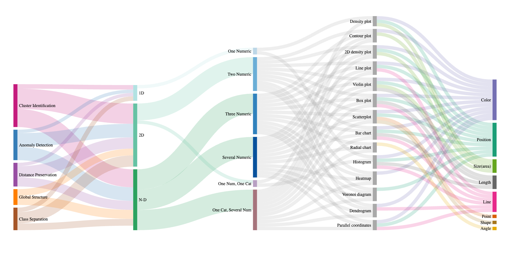

# FlowMDP

The repository is created for the following paper: 

***“Exploring Chart Choices for High Dimensional Projections"***

Please cite the paper as:
```latex
Bibtex citation placeholder
```

---
Abstract:

> Abstract placeholder

## Dependencies

The dependencies can also be found in [requirements.txt](https://github.com/nilegoose/FlowMDP/blob/data3/requirements.txt).

---



## License

Licensed under the GNU General Public License, Version 3.0 ([LICENSE](https://github.com/nilegoose/FlowMDP/blob/master/LICENSE) or https://www.gnu.org/licenses/gpl-3.0.en.html)

### Contribution

Any contribution intentionally submitted for inclusion in the work by you, shall be licensed under the GNU GPLv3.
